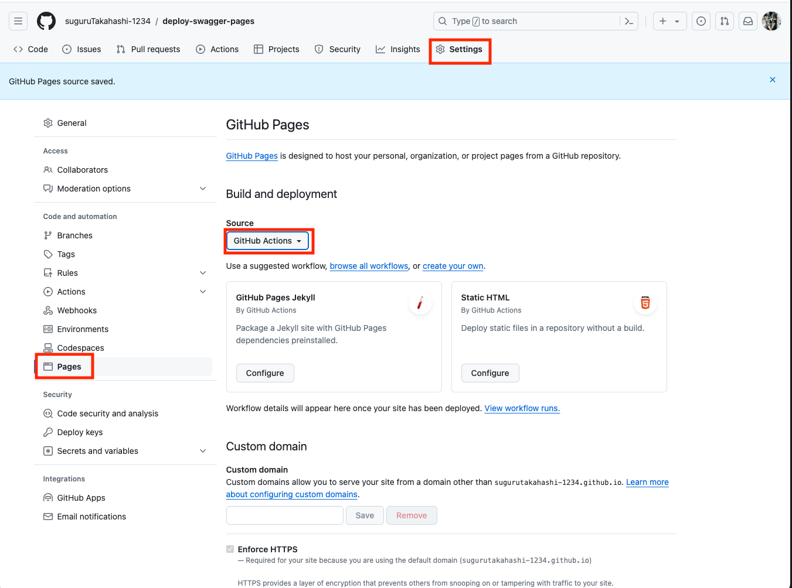

# deploy-swagger-pages

### Swagger UI

- https://sugurutakahashi-1234.github.io/deploy-swagger-pages/

### Step

### Lisks

- Swagger Editor
  - https://editor.swagger.io/
- Swaggerで作成したAPI仕様書をGitHub Pagesにデプロイしよう！
  - https://qiita.com/shun198/items/520806a86a14a4bd64a8
- GitHub Pages サイトの公開元を設定する
  - https://docs.github.com/ja/pages/getting-started-with-github-pages/configuring-a-publishing-source-for-your-github-pages-site
- GitHub Actions
  - https://github.com/actions/upload-artifact
  - https://github.com/Legion2/swagger-ui-action
  - https://github.com/actions/deploy-pages
